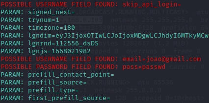

## Phishing para captura de senhas do Facebook

#### Ferramentas
- Kali Linux
- setoolkit

### Configurando o Phishing no Kali Linux
- Acesso root: sudo su
- Iniciando o setoolkit: setoolkit
- Tipo de ataque: Social-Engineering Attacks
- Vetor de ataque: Web Site Attack Vectors
- Método de ataque: Credential Harvester Attack Method 
- Método de ataque: Site Cloner
- Obtendo o endereço da máquina: ifconfig
- URL para clone: http://www.facebook.com

Resutados

Instalando biblioteca Pyaes no UV:

        uv add pyaes

Resolved 2 packages in 6.20s
      Built pyaes==1.6.1                                                                                                       
      Built codigos @ file://s                                        
Prepared 2 packages in 2.08s
Installed 2 packages in 55ms
 + codigos==0.1.0 (from file://s)
 + pyaes==1.6.1
(.venv) 