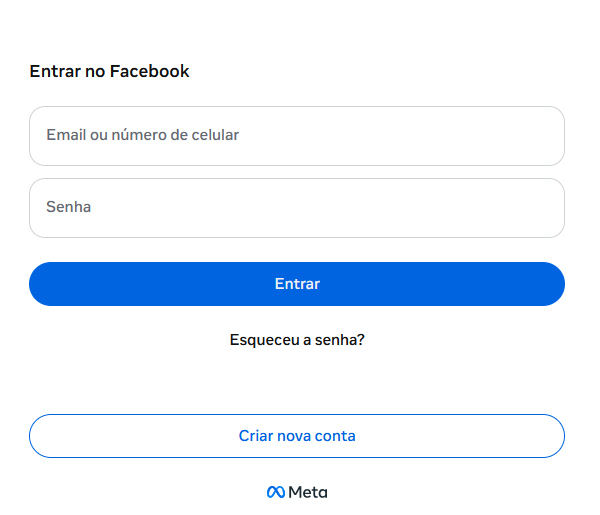
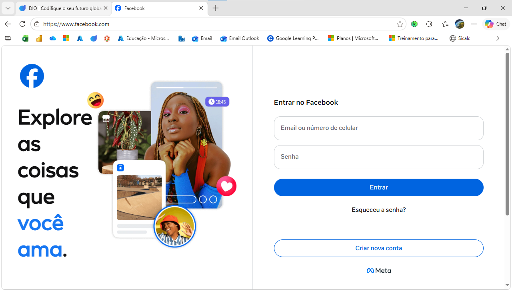
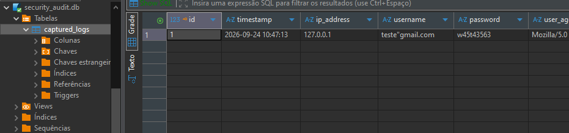

# Projeto de Estudo em Cibersegurança: Simulação de Phishing e Resposta Defensiva

Este projeto foi desenvolvido exclusivamente para fins educacionais e de investigação em ambiente controlado, com o objetivo de compreender os vetores de ataque baseados em engenharia social (clonagem de páginas de autenticação), o fluxo de persistência de credenciais e as estratégias de detecção, monitoramento e mitigação por parte das equipes de segurança defensiva.

---

### Arquitetura do Projeto

O laboratório simula um cenário real de phishing de login do Facebook, dividido em três componentes principais:

---
> [!IMPORTANT]  
> Apesar do Desafio indicar o uso do Kali Linux, este projeto focou em criar com **Python apenas**.
>


1. **Camada Ofensiva (Red Team / Simulação):**
   * Aplicação web desenvolvida em **Flask** que replica a interface de autenticação de uma plataforma popular para estudo visual e comportamental.
   * Interface otimizada em CSS Grid/Flexbox e estruturada em dois painéis (apresentação visual e formulário de credenciais).
 

2. **Camada de Persistência (Backend & Base de Dados):**
   * Captura controlada de dados submetidos no formulário de login.
   * Registo e armazenamento seguro (ou simulado) num banco de dados relacional para análise forense posterior.

3. **Camada Defensiva (Blue Team / Monitorização):**
   * Sistemas de logs estruturados para auditoria de requisições HTTP anômalas.
   * Mecanismos de alerta e detecção de tentativas de *phishing* (análise de domínios, cabeçalhos e padrões de tráfego atípicos).

---

### Tecnologias Utilizadas

* **Linguagem:** Python 3.x
* **Framework Web:** Flask
* **Frontend:** HTML5, CSS3 (Flexbox/Grid)
* **Base de Dados:** SQLite / PostgreSQL (conforme preferência do ambiente de laboratório)
* **Controlo de Versão:** Git

---

### Configuração e Execução do Laboratório

### 1. Clonar o Repositório

```
git clone https://github.com/area-41/Cybersecurity/tree/main/src/phising

cd phising
```

### 2. Configurar o Ambiente Virtual (Python)

```
python -m venv .venv
# No Windows:
.venv\Scripts\activate
# No Linux/macOS:
source .venv/bin/activate

```

### 3. Rodar Flask sem instalar as Dependências

```
uv run --with flask python servidor_avancado.py
```

```
[*] Banco de dados SQLite inicializado com sucesso.
[*] Servidor rodando em http://xxx.x.x.x:8080
 * Serving Flask app 'servidor_avancado'
 * Debug mode: on
WARNING: This is a development server. Do not use it in a production deployment. Use a production WSGI server instead.
 * Running on all addresses (0.0.0.0)
 * Running on http://xxx.x.x.x:8080
 * Running on http://xxx.xx.xx.xxx:8080
Press CTRL+C to quit
 * Restarting with stat
[*] Banco de dados SQLite inicializado com sucesso.
[*] Servidor rodando em http://xxx.x.x.x:8080
 * Debugger is active!
 * Debugger PIN: xxx-xxx-x00
xxx.x.x.x - - [24/Sep/2026 10:46:57] "GET / HTTP/1.1" 200 -

🔥🔥🔥🔥🔥🔥🔥🔥🔥🔥🔥🔥🔥🔥🔥🔥🔥🔥🔥🔥🔥🔥🔥🔥🔥 ALERTA DE SEGURANÇA 🔥🔥🔥🔥🔥🔥🔥🔥🔥🔥🔥🔥🔥🔥🔥🔥🔥🔥🔥🔥🔥🔥🔥🔥🔥
[2026-09-24 10:47:13] Requisição POST interceptada com sucesso!
 -> IP de Origem  : xxx.x.x.1
 -> Usuário/Email : teste@gmail.com
 -> Senha Digitada: w45t43563
 -> Status Banco  : SUCESSO (Salvo em security_audit.db)
=========================================================================
```

### 4. Organização das Pastas

Certifique-se de que a estrutura do projeto respeita o padrão exigido pelo Flask para ficheiros estáticos:

```
projeto/
├── servidor_avancado.py  
└── static/
    └── image-3.png
```
Detalhes do formulário original:



### 5. Executar a Aplicação

```
uv run --with flask python servidor_avancado.py
```

#### Acesse a página através do navegador na porta 8080

#### Site verdadeiro:



#### Site fake clonado:


#### Persistência dos dados capturados em db:

---

### Perspectiva da Equipe Defensiva - Blue Team

No contexto de um exercício de *Purple Teaming*, este laboratório permite treinar as seguintes capacidades defensivas:

* **Análise de Indicadores de Compromisso (IOCs):** Identificação de páginas falsas alojadas em domínios não oficiais ou portas locais de teste.
* **Monitorizamentoo de Tráfego Web:** Registo de acessos através de Web Application Firewalls (WAF) e criação de regras de detecção de assinaturas HTML/CSS clonadas.
* **Resposta a Incidentes:** Protocolos de derrubada (*takedown*) de domínios maliciosos e análise forense dos dados recolhidos no servidor de base de dados comprometido.


## ⚠️ Aviso Legal

> **Aviso:** Este repositório tem caráter estritamente educativo e de investigação acadêmica em cibersegurança. O uso destas técnicas contra sistemas reais sem autorização prévia é ilegal e viola os termos de serviço das plataformas, bem como a legislação de cibercrime aplicável. O autor declina qualquer responsabilidade pelo uso indevido do código aqui presente.